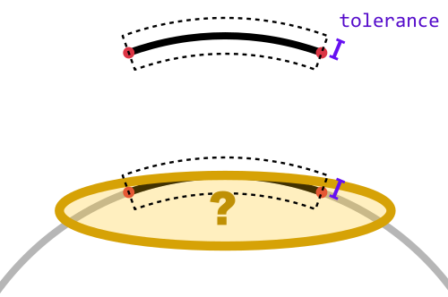
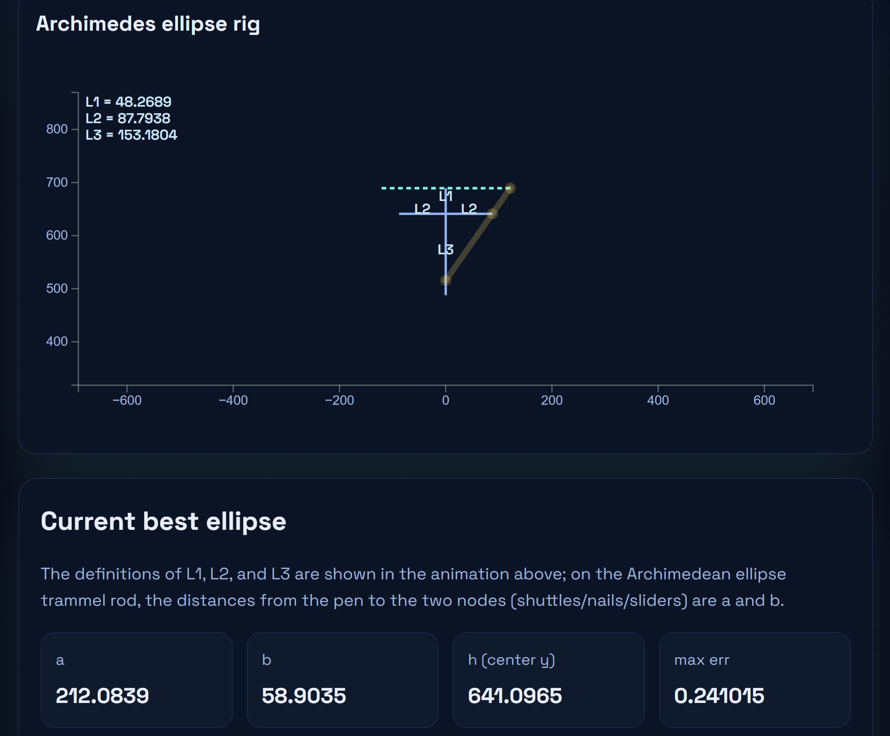
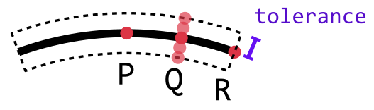
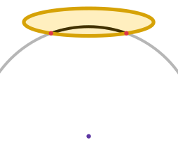

<!-- h2 之前空三行 -->

README.md
=========

這個專案的目的是找出一些較小的橢圓，用該橢圓的一段弧長（橢圓弧）來代替半徑很大但弦長不大的圓弧。

使用看看：https://davidhu3141.github.io/ArcApproxByEllipse/?lang=zh-tw

本工具有針對手機瀏覽設計 (RWD)。

動機
----

我朋友想要在木板上裁切一個半徑 `700 cm`、弦長 `250 cm` 的圓弧，但房間容納不下這麼大的圓規。我想到他之前曾使用「阿基米德橢圓規」來畫橢圓，或許我們能嘗試用橢圓規來近似圓弧。

也不知道這個做法是否符合木工的真實需求或施工情境，但我想這個專案如果做得出來應該還是滿有趣的，可以探索橢圓與圓的關係。也可能真的可行或其他人有需要這個工具也說不定，所以還是寫寫看。

所謂的阿基米德橢圓規，是指在一個木條上 (下圖綠色線段) 取兩個相異處釘上釘子 (紅點與藍點)，再取一處綁上一支筆 (黑點)。將釘子分別在兩個相互垂直的凹槽滑動，筆就能畫出橢圓。橢圓的半長軸/半短軸就是筆到兩個釘子的距離。

下圖是筆在兩釘子中間的情況

下圖是筆不在兩釘子中間的情況。當 m 介於 `0~1` 之間會變回上面的 case.

使用說明 / 參數說明
-----------------

### 圓弧設定 (R, theta or chord, tolerance)

考慮一個圓弧半徑為 R，圓心角為 *θ* (theta)。也可指定其弦長 (chord) 而非圓心角。

接著指定一個容許值 (tolerance) ，則此工具會找到一個與圓弧接近，且儘量小的橢圓。該橢圓與圓弧雖有些偏離，但誤差小於容許值。

加大容許值有利於找到更小的橢圓，但不建議將容許值設定為大於半徑的 10% (例如 R=700, tolerance=70)，因為這會導致此工具將一些不合理的橢圓納入候選，進而排擠掉合理的橢圓被找到的機會。

### 端點與中點

預設情況下，找到的橢圓的兩端 (endpoints) 與中點 (midpoint) 都會在圓弧上，除此之外的其他點都會有一個誤差 error，其值小於 tolerance。

在進階設定中可以設定允許橢圓的兩端或中點也有誤差，這樣找到的橢圓會再更小一點。這將在進階設定的段落說明。

### 輸出說明

找到適合的橢圓之後，本工具會畫出橢圓，並顯示以下參數

- a: 半長軸
- b: 半短軸
- L1: 弦到橢圓中心的距離
- L2: 阿基米德橢圓規上，橫向滑動的點的最遠滑動距離
- L3: 阿基米德橢圓規上，縱向滑動的點的最遠滑動距離，也就是a-b
- t0: 阿基米德橢圓規的桿子擺動的初始角度 (相對於 x 軸)

也會將橢圓各處的誤差以圖表呈現。橫軸的角度指的是圓弧上的點與 x 軸的夾角

因此 Error vs Angle 圖表上的點，例如 (110, 0.05) 或 (66, 0.07)，就代表 110 與 66 這兩處的誤差值是 0.05 與 0.07。圖表的橫軸是由大到小，方便視覺上對應到圓弧上。

### 進階設定

三個點可以決定至多一個沿 y 軸對稱的橢圓。我將這三個點取在圓弧中點、右 1/4 處、右端點，分別命名為 P, Q, R。在 tolerance 範圍內，Q 可以有徑向的小偏移 (偏移量小於容許值)，不同的偏移量可以決定一個不同的橢圓，然後程式會在所有嘗試過的橢圓中找一個長軸最小的作為答案。

我猜測在許多使用場景應該會希望 P 與 R 能完全在圓弧上而不偏離，因此預設只有 Q 的步數能設定。取消勾選「停用 P/R 取樣」之後也能設定 P 與 R 的取樣步數。

「誤差取樣步數」的選項則是決定在橢圓上取多少點來確認誤差是否符合容許值。

也能將程式設定為「回傳 a+b 最小的橢圓」而非 a 最小的。

也可顯示「已嘗試的橢圓半軸」圖表，這是我原本想觀察在一定容許值下 a b 的可行解區域而做。有綠點之處是可行解區域內部，灰點代表嘗試失敗的 P Q R 組合所換算出來的 a b 值，但未必代表該 a b 值不在可行解區域內，因為也可能該橢圓平移過後仍能落在容許值內。

如果取消勾選「若橢圓已比目前最小的還大則跳過誤差驗證」，則會拖慢運算速度。這可以用來在「已嘗試的橢圓半軸」圖表中畫出更多點以觀察可行解區域。

實作細節 src/lib/search.js
-------------------------

### solveABC(-), toCanonical(-) 

我們要找的橢圓只有三個變量需要確定：長軸 a、短軸 b、中心高度 h，因此可列式為 $$\frac{x^2}{a^2}+\frac{(y-h)^2}{b^2}=1$$。也可以展開為 $x^2+Ay^2+By+C=0$。兩者容易互相換算。

總之就是有三個未知數，所以需要有三個(不共線的)點來決定該橢圓。

只要我們確定了橢圓上的三個點，就能代入 $x^2+Ay^2+By+C=0$ 得到 $A,B,C$ 的線性方程組，進而求出 $A,B,C$ 並換算成 $a,b,h$。也有可能 $B<0$ 導致求出雙曲線而非橢圓。

### runEllipseSearch(-)

P Q R 三點分別可以有個徑向的誤差 (d1, d, d2)，預設會停用 P 與 R 的取樣，因此 d1=d2=0。決定好誤差之後就能找到通過 P Q R 三點的橢圓。

- case 1: 如果找到的不是橢圓而是雙曲線則跳過
- case 2: 如果橢圓的中心比弦還要高則跳過 (容許值大得誇張時會發生，此時橢圓以下緣接觸弦的兩端)
- case 3: 如果誤差大於容許值則跳過 (即使 d1, d, d2 已確定小於容許值，也可能在 P-Q Q-R 之間的地方區段超出容許值)

一般來說，當使用者增加誤差容許值，此時由於條件被放寬，應能找到更小的橢圓。但當使用者將容許值設成誇張地過大 (例如大於半徑的 10%)，偏移量的取樣步長也會隨之變大，導致測試的橢圓大部分都被 case 2 過濾掉，因此找不到比圓還小的橢圓。Case 2 的示意圖如下：

其他想法
-------

這個程式沒針對「筆在釘子之間」的那種橢圓規來設計。我想那種橢圓規會用到更多空間，而且是用來畫長短軸差異較小的橢圓。主要也是懶得寫。

應該可以觀察 a b 的可行解區域，但暫時沒空。