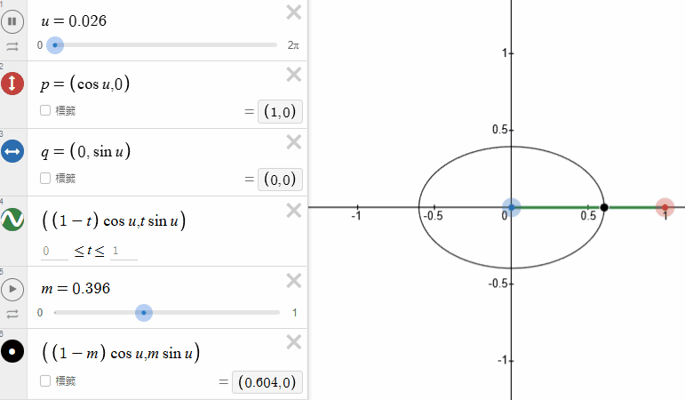
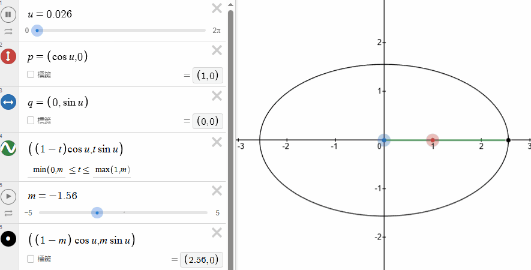
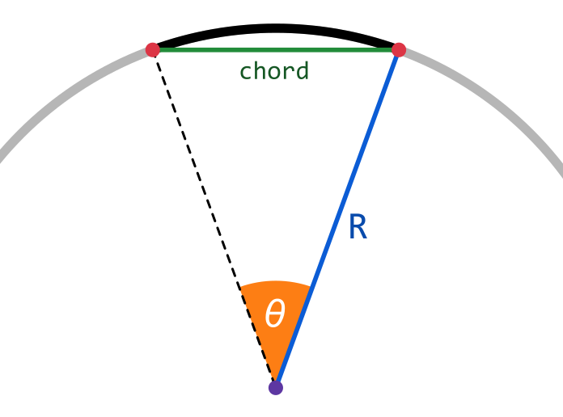
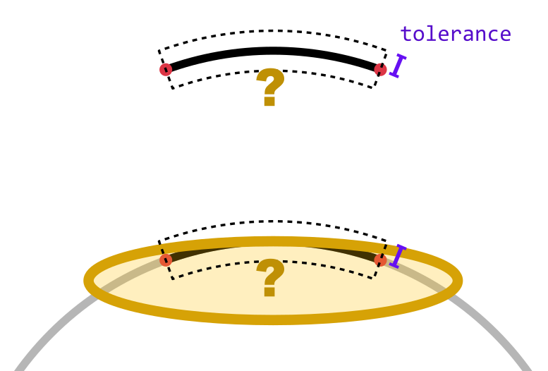
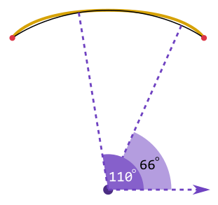
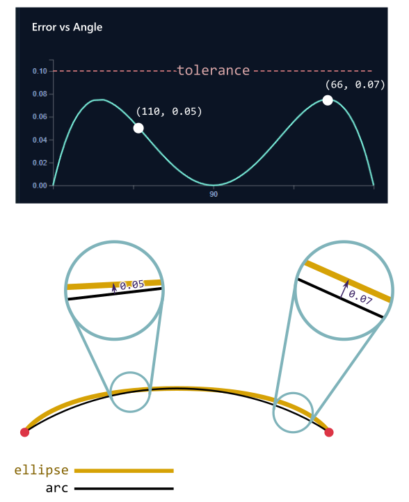
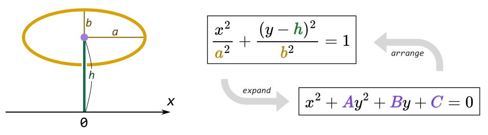
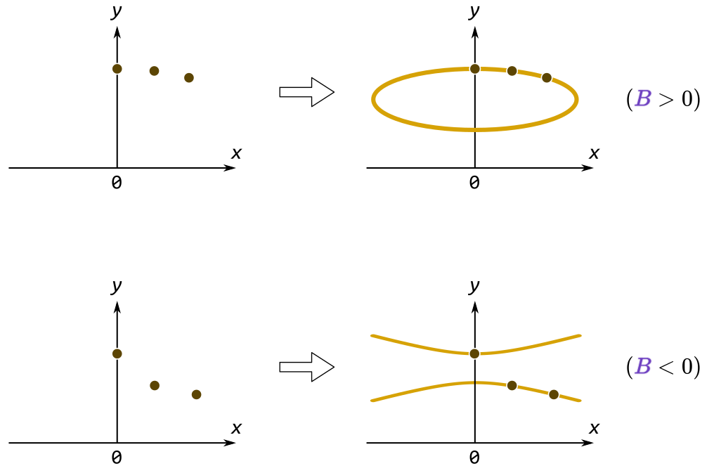

<!-- h2 之前空三行 -->

README.md
=========

這個專案的目的是找出一些較小的橢圓，用該橢圓的一段弧長（橢圓弧）來代替半徑很大但弦長不大的圓弧。

<!-- pic, site gif -->

使用看看：https://davidhu3141.github.io/ArcApproxByEllipse/?lang=zh-tw

動機
----

我朋友想要在木板上裁切一個半徑 `700 cm`、弦長 `250 cm` 的圓弧，但房間容納不下這麼大的圓規。我想到他之前曾使用「阿基米德橢圓規」來畫橢圓，或許我們能嘗試用橢圓規來近似圓弧。

也不知道這個做法是否符合木工的真實需求或施工情境，但我想這個專案如果做得出來應該還是滿有趣的，可以探索橢圓與圓的關係。也可能真的可行或其他人有需要這個工具也說不定，所以還是寫寫看。

所謂的阿基米德橢圓規，是指在一個木條上 (下圖綠色線段) 取兩個相異處釘上釘子 (紅點與藍點)，再取一處綁上一枝筆 (黑點)。將釘子分別兩個相互垂直的凹槽滑動，筆就能畫出橢圓。橢圓的半長軸/半短軸就是筆到兩個釘子的距離。

下圖是筆在兩釘子中間的情況

下圖是筆不在兩釘子中間的情況。當 m 介於 `0~1` 之間會變回上面的 case.

使用說明 / 參數說明
-----------------

### 圓弧設定 (R, theta or chord, tolerance)

考慮一個圓弧半徑為 R，圓心角為 *θ* (theta)。也可指定其弦長 (chord) 而非圓心角。

接著指定一個容忍值 (tolerance) ，則此工具會找到一個與圓弧接近，且儘量小的橢圓。該橢圓與圓弧雖有些偏離，但誤差小於容忍值。

### 端點與中點

預設情況下，找到的橢圓的兩端 (endpoints) 與中點 (midpoint) 都會在圓弧上，除此之外的其他點都會有一個誤差 error，其值小於 tolerance。

在進階設定中可以設定允許橢圓的兩端或中點也有誤差，這樣找到的橢圓會再更小一點。這將在進階設定的段落說明。

### 輸出說明

找到適合的橢圓之後，本工具會畫出橢圓，並顯示以下參數

- a: 半長軸
- b: 半短軸
- L1: 弦到橢圓中心的距離
- L2: 阿基米德橢圓規上，橫向滑動的點的最遠滑動距離
- L3: 阿基米德橢圓規上，縱向滑動的點的最遠滑動距離，也就是a-b
- t0: 阿基米德橢圓規的桿子擺動的初始角度

<!-- pic, site gif -->

也會將橢圓各處的誤差以圖表呈現。橫軸的角度指的是圓弧上的點與 x 軸的夾角

因此 Error vs Angle 圖表上的點，例如 (110, 0.05) 或 (66, 0.07)，就代表 110 與 66 這兩處的誤差值是 0.05 與 0.07。圖表的橫軸是由大到小，方便視覺上對應到圓弧上。

### 進階設定

三個點可以決定至多一個沿 y 軸對稱的橢圓。我將這三個點取在圓弧中點、右 1/4 處、右端點，分別命名為 P, Q, R。

<!-- pic -->

在 tolerance 範圍內，P, Q, R 可以有徑向的小偏移，不同的偏移量可以決定一個不同的橢圓，然後程式會在所有嘗試過的橢圓中找一個長軸最小的做為答案。

<!-- pic -->

在進階設定中可以設定 P, Q, R 取樣的步數，但我猜測在許多使用場景應該會希望 P 與 R 能完全在圓弧上而不偏離，因此預設只有 Q 的步數能設定。勾選...之後也能設定 P 與 R 的取樣步數。

<!-- pic -->
<!-- scrshot -->

也能將程式設定為「回傳 a+b 最小的橢圓」。

### 實作細節 src/lib/search.js

#### solveABC(-), toCanonical(-) 

我們要找的橢圓只有三個變量需要確定：長軸 a、短軸 b、中心高度 h，因此可列式為 $$\frac{x^2}{a^2}+\frac{(y-h)^2}{b^2}=1$$。也可以展開為 $x^2+Ay^2+By+C=0$。兩者容易互相換算。

總之就是有三個未知數，所以需要有三個(不共線的)點來決定該橢圓。

只要我們確定了橢圓上的三個點，就能代入 $x^2+Ay^2+By+C=0$ 得到 $A,B,C$ 的線性方程組，進而求出 $A,B,C$ 並換算成 $a,b,h$。也有可能 $B<0$ 導致求出雙曲線而非橢圓。

#### runEllipseSearch(-)

如何決定橢圓上的三個點呢？我們將這三個點 (稱之 P, Q, R) 取在圓弧的中點 (P)、中點與右端的之間 (Q)、右端 (R)。三點分別可以有個徑向的誤差 (d1, d, d2)，預設 d1=0, -tolerance $\leq$ d $\leq$ tolerance, d2=0，此時圓弧中點與端點不會有誤差。

若取消勾選進階設定的...，則中點或端點也能有誤差，此時由於條件被放寬，應能找到更小的橢圓。

計算結果
-------

利用此程式運算之後，如果允許 $0.5$ 公分以內的誤差：

- 該圓弧可以使用半長軸 `a = 185.4 cm`、半短軸 `b = 43.0 cm` 的橢圓來近似。
- 此時橢圓規擺動時所需要的空間約為 `底 x 高 = 250 cm (弦長本身) x 185.4 cm (a值)` 的三角形
    - 原本圓規擺動需要的空間約為 `底 x 高 = 250 cm (弦長本身) x 700 cm (半徑)` 的三角形

<!-- pic -->

這是在弧中點與弧端點都不能有誤差的前提下計算的，只有接近端點處誤差會較大。如果允許弧中點有誤差的話可以得到更小的 `a` 值。

<!-- pic -->

#### 觀察

其他想法
-------

這個程式沒針對「筆在釘子之間」的那種橢圓規來設計。我想那種橢圓規會用到更多空間，而且是用來畫長短軸差異較小的橢圓。主要也是懶得寫。
